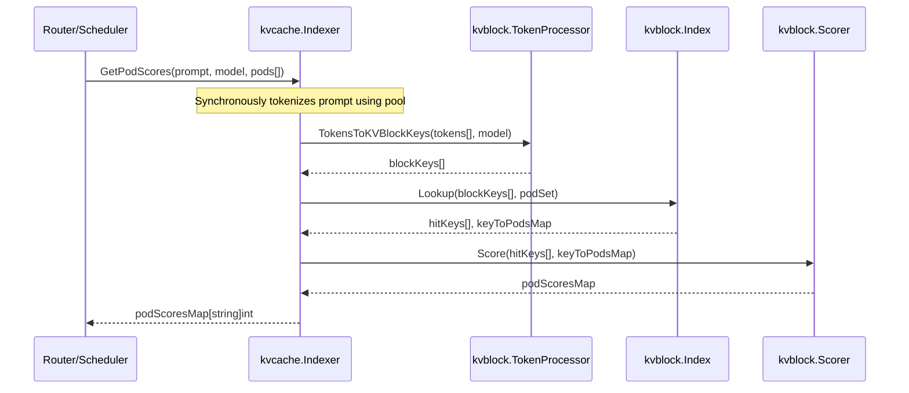
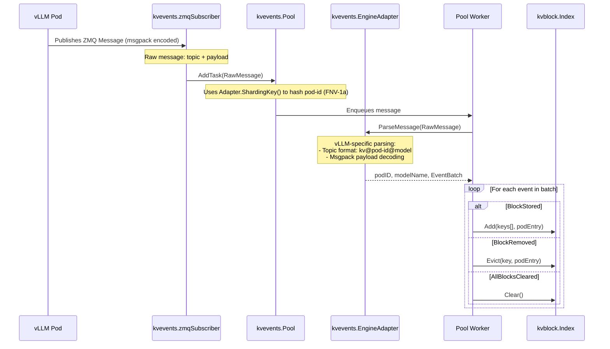

# KV-Cache Indexer: Architecture

The **KV-Cache Indexer** is a high-performance library that keeps a global, near-real-time view of KV-Cache block locality across a fleet of vLLM pods. 
Its purpose is the enablement of smart routing and scheduling by exposing a fast, intelligent scoring mechanism for vLLM pods based on their cached KV-blocks.

-----

## System Architecture

The Indexer is built from several modules that work together, each with clear responsibilities.
Separating concerns is a guiding principle in the design of this system.

| Module | Purpose                                                      | Default Implementation                                          |
| :--- |:-------------------------------------------------------------|:----------------------------------------------------------------|
| **`kvcache.Indexer`** | The main orchestrator that handles scoring requests          | Coordinates all internal modules                                |
| **`kvevents.Pool`** | Ingests and processes KV-cache events from inference engines | A sharded worker pool using ZMQ for event subscription          |
| **`kvevents.EngineAdapter`** | Parses engine-specific raw event messages into domain events | vLLM adapter for msgpack-encoded vLLM events                    |
| **`kvblock.Index`** | The core data store mapping KV-block hashes to pod locations | An in-memory, two-level LRU cache                               |
| **`kvblock.TokenProcessor`**| Converts token sequences into KV-block keys                  | Uses a chunking and hashing algorithm compatible with vLLM      |
| **`kvblock.Scorer`** | Scores pods based on the sequence of cache hits              | Implements a longest consecutive prefix matching strategy       |

-----

## Data Flow & Processes

The system has two primary data flows: the **Read Path** for scoring pods and the **Write Path** for ingesting cache events.

### Read Path: Scoring a Prompt

When a router needs to pick the best pod for a new prompt, it triggers the Read Path. 
The goal is to find the pod that has the longest sequence of relevant KV-blocks already in its cache.
A list of pods with their scores is returned to the router.



**Key Steps:**

1.  **Tokenization**: The `Indexer` performs synchronous tokenization of the prompt using the worker pool.
2.  **Key Generation**: The tokenized sequence is sent to the `TokenProcessor`, which chunks and hashes them into a sequence of deterministic KV-block keys that match vLLM's logic.
3.  **Index Lookup**: With the keys, the `Indexer` queries the `kvblock.Index` to see which pods have them. The lookup is optimized to find the longest *consecutive* chain of hits from the start.
4.  **Scoring**: The `Scorer` takes the hit data and scores each pod based on its number of consecutive matching blocks.
5.  **Response**: A final map of pod scores is sent back to the router.

Note: The tokenization pool now supports both asynchronous (fire-and-forget) and synchronous modes, ensuring scoring requests can always return complete results.

### Write Path: Processing Cache Events

The Write Path keeps the index up-to-date by processing a constant stream of events from the vLLM fleet.



**Key Steps:**

1.  **Event Publication**: An inference engine pod (e.g., vLLM) emits an event, like `BlockStored`, when its cache changes. The event is published to a ZMQ topic.
2.  **Message Reception**: The `zmqSubscriber` receives the raw message (topic + payload) without parsing engine-specific formats.
3.  **Sharded Queuing**: The message goes to the `kvevents.Pool`, which uses the `EngineAdapter.ShardingKey()` method to extract the pod identifier and hash it (using FNV-1a) to select a specific worker queue. This guarantees that events from the same pod are always processed in order.
4.  **Engine-Specific Parsing**: A worker pulls the message and calls `EngineAdapter.ParseMessage()` to decode the engine-specific format. For vLLM, this parses the topic format (`kv@pod-id@model`) and decodes the msgpack payload into a batch of generic events (`BlockStored`, `BlockRemoved`, `AllBlocksCleared`).
5.  **Index Update**: The worker applies each event to the `kvblock.Index`, either adding a new block location or evicting an old one.

-----

## Component Deep Dives

### Engine Adapter Pattern

The `kvevents.EngineAdapter` interface provides an abstraction layer that decouples the event processing pipeline from engine-specific message formats. This design enables support for multiple inference engines without modifying the core event processing logic.

**Interface Definition:**
```go
type EngineAdapter interface {
    // ParseMessage parses a raw transport message into domain data
    ParseMessage(msg *RawMessage) (podID, modelName string, batch EventBatch, err error)
    
    // ShardingKey extracts the key used to shard messages across worker queues
    ShardingKey(msg *RawMessage) string
}
```

**vLLM Adapter Implementation:**

The default `VLLMAdapter` handles vLLM-specific formats:

* **Topic Format**: Parses `kv@<pod-id>@<model-name>` to extract pod identity and model information
* **Payload Encoding**: Decodes msgpack-encoded event batches containing arrays of events
* **Event Mapping**: Maps vLLM event tags to corresponding event structs (`BlockStored`, `BlockRemoved`, `AllBlocksCleared`)

-----

#### KV-Block Hashing & Generation

To guarantee compatibility, the indexer perfectly matches vLLM's content-addressing logic.

* **Token Chunking**: Prompts are converted to tokens, which are then grouped into fixed-size chunks (default: 16).
* **Hash Algorithm**: A chained hash is computed. Each block's key is an **FNV-64a hash**, generated from the CBOR-encoded `[parentHash, tokenChunk, extra]` tuple.
* **Initialization**: The hash chain starts with a configurable `HashSeed`. This value's source **must** align with the `PYTHONHASHSEED` environment variable in the vLLM pods to ensure hashes are consistent across the entire system.
* **Extra Parameter**: The third component of the hash tuple enables cache differentiation:
  - **nil** (default): Standard prompts without LoRA or multi-modal content
  - **int**: LoRA adapter ID (e.g., 42)
  - **string**: Adapter name or content-affecting identifier (e.g., "lora-v2")
  - **map**: Structured metadata (e.g., `{"lora_id": 42, "medium": "gpu"}`)
Different `extra` values produce different block hashes, preventing cache pollution when the same tokens are used with different adapters or multi-modal inputs.
#### Index Backends

The `kvblock.Index` is an interface with swappable backends.

* **In-Memory (Default)**: A very fast, thread-safe, two-level LRU cache using `hashicorp/golang-lru`. The first level maps a block key to a second-level cache of pods that have the block. It prioritizes speed over persistence, which is usually the right trade-off for ephemeral cache data.
* **Cost-Aware Memory (Optional)**: A memory-efficient implementation using the `hypermodeinc/ristretto` cache library that provides cost-aware eviction based on actual memory usage. Unlike the basic in-memory backend, this implementation calculates the memory footprint of each cache entry and uses this information for intelligent eviction decisions. This is particularly useful when memory usage patterns vary significantly across different keys.
* **Redis (Optional)**: A distributed backend that can be shared by multiple indexer replicas. It can offer scalability and persistence, but this may be overkill given the short lifetime of most KV-cache blocks.
* **Valkey (Optional)**: A Redis-compatible, open-source alternative that provides the same distributed capabilities as Redis but remains under the BSD license. Valkey offers additional performance benefits through RDMA support for reduced latency, making it particularly suitable for high-performance LLM inference workloads. Since Valkey is API-compatible with Redis, it can be used as a drop-in replacement.

#### Tokenization Subsystem

Efficiently handling tokenization is critical for performance. The system is designed to tokenize prompts quickly using a worker pool that supports both asynchronous and synchronous operations.

* **Tokenization Pool**: The `tokenization.Pool` provides both asynchronous (fire-and-forget) and synchronous tokenization modes. For scoring requests, synchronous tokenization ensures complete results are always returned. The pool uses a configurable number of workers to process requests efficiently.
* **Tokenizer Backends**: The system supports multiple tokenizer backends with a composite fallback strategy:
    * **`CachedLocalTokenizer`**: Loads tokenizers from local files on disk. This is particularly useful for air-gapped environments, custom tokenizers, or when models are pre-loaded. It supports:
        * **Manual Configuration**: Direct mapping from model names to tokenizer file paths
        * **Auto-Discovery**: Automatic scanning of directories to find tokenizer files
        * **HuggingFace Cache Structure**: Automatically detects and parses HF cache directories (e.g., `models--Qwen--Qwen3-0.6B/snapshots/{hash}/tokenizer.json` → `Qwen/Qwen3-0.6B`)
        * **Custom Directory Structures**: Supports arbitrary nesting (e.g., `/mnt/models/org/model/tokenizer.json` → `org/model`)
    * **`CachedHFTokenizer`**: Downloads and caches tokenizers from HuggingFace. It wraps Hugging Face's high-performance Rust tokenizers and maintains an LRU cache of active tokenizer instances to avoid repeated loading from disk.
    * **`CompositeTokenizer` (Default)**: Tries tokenizer backends in order, enabling graceful fallback. The default configuration attempts local tokenizers first, then falls back to HuggingFace if the model isn't found locally. This provides the best of both worlds: fast local access when available, with automatic fallback to remote fetching.
* **Tokenizer Caching**: All tokenizer implementations maintain an LRU cache of loaded tokenizer instances to minimize the overhead of repeatedly loading models from disk.

-----

## Dependencies

The Indexer relies on several libraries and tools:
  * Used for tokenization of prompts. 
* **[pebbe/zmq4](https://github.com/pebbe/zmq4)**: Go bindings for ZeroMQ.
  * Used for the event processing pool and communication between components.
  * Requires `libzmq` library to be installed on the system.
* **Python**: Required to run a CGO binding for the `chat_completions_template` package.
  * Used for vllm templating of chat completions requests.